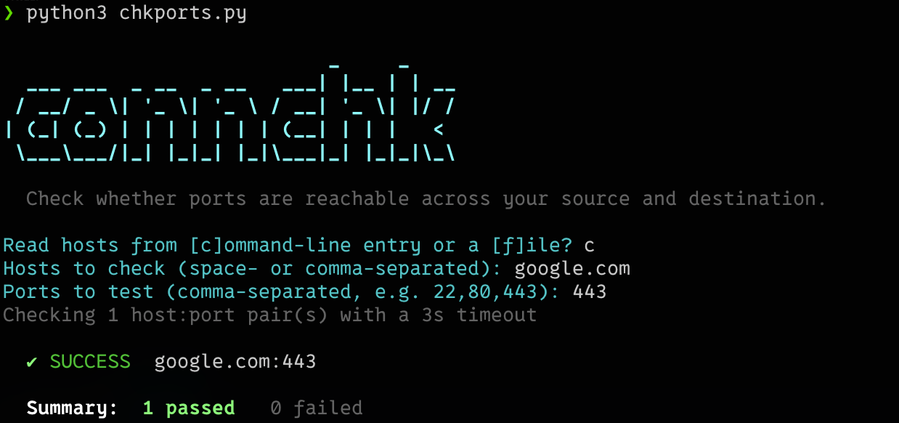

# connchk

[](https://github.com/iamteedoh/connchk/actions/workflows/ci.yml)

[](https://github.com/sponsors/iamteedoh)
[](https://patreon.com/iamteedoh)
[](https://buymeacoffee.com/iamteedoh)

A tool to check if the connectivity of a system exists between source and destination



## What's in the repo

- `chkports.py` — TCP port checker. Takes hosts as arguments or from a file and
  ports as a comma-separated list, then prints a color-coded ✔/✘ line per
  host:port pair with a pass/fail summary. Runs non-interactively when you pass
  flags, or drops into guided prompts for anything you leave out.
- `connchk.py` — runner around the same check with a local/remote switch.
  Remote mode connects over SSH (paramiko), copies `chkports.py` to `/tmp` on
  the target, runs it there, streams the output back, and removes the file
  afterwards. Also runs non-interactively or with guided prompts.

Both scripts print a title banner (suppress it with `--no-banner`), exit `0`
when every port connected and `1` when any failed (handy for scripting), and
accept `--no-color` for plain output.

## Requirements

- Python 3
- `colorama` (both scripts) and `paramiko` (`connchk.py` remote mode):

```bash
python -m pip install -r requirements.txt
```

## Usage

Run either script with no arguments for a fully interactive, guided session,
or pass flags to run non-interactively. Both accept `--help`.

### Check ports from the local machine

Hosts as command-line arguments:

```bash
python3 chkports.py 192.0.2.10 192.0.2.20 --ports 22,80,443
```

Hosts from a file, one per line (blank lines and `#` comments are ignored):

```bash
python3 chkports.py --file hosts.txt --ports 443 --timeout 1.5
```

Every host is checked against every port. `--timeout` sets the per-connection
timeout in seconds (default `3`). With no `--ports` (or no hosts), the script
prompts you for what's missing.

### Run the check locally or on a remote host

Locally:

```bash
python3 connchk.py --local 192.0.2.10 192.0.2.20 --ports 22,80,443
```

On a remote host over SSH:

```bash
python3 connchk.py --remote --host 192.0.2.50 --user ops \
  --file hosts.txt --ports 443
```

`connchk.py` copies `chkports.py` to the target and runs the check from there.
For non-interactive remote runs, authenticate with an SSH key via `--identity
~/.ssh/id_ed25519`, or supply a password through the `CONNCHK_PASSWORD`
environment variable. Run `connchk.py` with no mode flag to be asked whether to
go local (`l`) or remote (`r`) and prompted for any missing details.

Note: remote mode auto-accepts unknown SSH host keys (`AutoAddPolicy`). Be
careful with this outside of environments you control — don't blindly trust
host keys of systems you don't recognize.

## License

connchk is licensed under the [GNU General Public License v3](LICENSE).

## Contributing

See [CONTRIBUTING.md](CONTRIBUTING.md) for local setup, the validation
suite, and the pull request process.

## Security

Please report vulnerabilities privately — see [SECURITY.md](SECURITY.md).
Never include passwords, SSH keys, or private host details in public issues.
